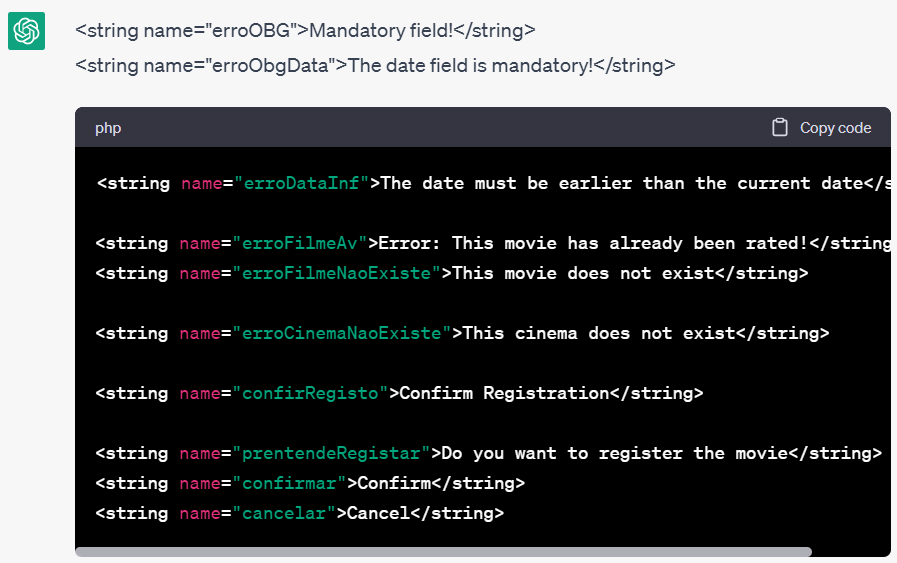
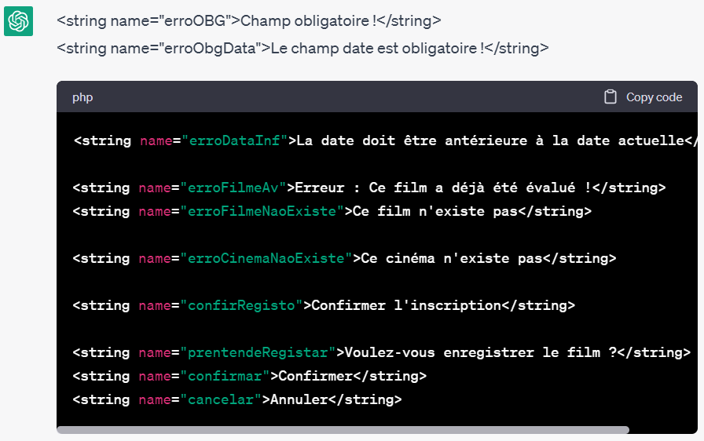

## Dados de aluno

Nome: Bruno Mateus  
Número: a22102554  
Nome: Diogo Moreira  
Número: a22103941  

## Filmes hardcoded:
John Wick 4  
Avatar 2  
Shazam  
Homem-Aranha 3  

| Critério                                           | Funcionalidades                                                                                                                                                                       |
|----------------------------------------------------|---------------------------------------------------------------------------------------------------------------------------------------------------------------------------------------|
| Dashboard                                          | Existe um ecrã dashboard que permite viualizar o numero de filmes já vistos e um top 5 dos filmes melhor classificados                                                                |
| Apresentação dos filmes -Lista                     | Existe um ecrã onde é representado a lista dos Filmes visualizados                                                                                                                    |
| Apresentação dos filmes - Lista - Rotação          | É possivel rodar o ecrá desse mesmo ecrã de lista, onde acrescenta as observações de cada filme                                                                                       |
| Apresentação dos filmes - Mapa (imagem)            | Existe um ecrã dedicado ao Mapa, onde aparece uma imagem de um mapa dos cinemas de Lisboas                                                                                            |
| Detalhe do filme (sem fotografias)                 | É possivel verificar o detalhe de cada filme na lista, ao selecionar o mesmo irá apresentar um ecrã "Detalhe" onde representa toda a informação solicitada em enunciado de cada filme |
| Detalhe do filme (apenas a parte das fotografias)  | No Ecrã é tambem possivel visualizar as fotografias inseridas no registo                                                                                                              |
| Pesquisa de filmes por voz                         | Existe um botão com um icon de um microfone na barra superior onde ao selecionar abre uma pop-up com uma contagem de 10segundos conforme solicitado em enunciado                      |
| Registo de filmes (sem fotografias)                | Existe um ecrã para efectuar o registo de cada filme com todos os dados pedidos em enunciado                                                                                          |
| Registo de filmes (apenas a parte das fotografias) | Nesse mesmo ecrã é possivel registar tambem as fotografias tiradas através da camera                                                                                                  |
| Suporte multi-idioma                               | Existe tambem suporte de multi-idioma, para as linguagens: Portugues, Frances e Ingles                                                                                                |
| Navegabilidade                                     | A navegação entre ecrãs é feita através de drawer                                                                                                                                     |

### Autoavaliação = 17

## Classes de Lógica de Negócio 

#### Classe Filme:
- Atributos:  
-- nome - String  
-- cinema - String  
-- avaliacao - Int  
-- dataVisualizacao - Calendar  
-- fotos - List<File>  
-- observacoes - String  
-- listImgGet - List<File>  
- Métodos:  
-- listImgGet() : List<File>  

#### Classe Filmes:
- Atributos:  
-- listImg - mutableListOf<File>  
-- listImgGet - List  
-- history - mutableListOf<Filme>  
- Métodos:  
-- listImgGet() : List<File>  
-- imagemSet(imgFile : File)  
-- imagensListClear()  
-- history() : List<Filme>  
-- historySet (nome:String, cinema:String, avaliacao:Int, data: Calendar, imgList: List<File>, obs:String):Int  
-- top5Filmes() : List<Filme>  
-- countFilmes() : Int  

#### Classe Cinema:
- Atributos:  
-- cinemaName - String  

#### Classe Cinemas:
- Atributos:  
-- cinema1 - Cinema  
-- cinema2 - Cinema  
-- cinema3 - Cinema  
-- cinema4 - Cinema  
-- cinema5 - Cinema  
-- cinema6 - Cinema  
-- cinema7 - Cinema  
-- cinema8 - Cinema  
-- cinema9 - Cinema  
-- cinema10 - Cinema  
-- cinema11 - Cinema  
-- listCinemas - mutableListOf<Cinema>  
-- getListCinemas - List<Cinema>  
- Métodos:  
-- getListCinemas : List<Cinema>  
-- nomesCinemasGet : List<String>  

#### Classe FilmeIMDB:
- Atributos:  
-- nomeImdb - String  
-- generoImdb - String  
-- dataImdb - String  
-- avaliacaoImdb - String  
-- imgImdb - String  
-- sinopse - String  

#### Classe FilmesIMDB:
- Atributos:  
-- filme1 - FilmeIMDB  
-- filme2 - FilmeIMDB  
-- filme3 - FilmeIMDB  
-- filme4 - FilmeIMDB  
-- listFilmesImdb - mutableListOf<FilmeIMDB>  
-- getListFilmesImdb - List<FilmeIMDB>  
- Métodos:  
-- getListFilmesImdb : List<FilmeIMDB>  
-- nomesFilmesGet : List<String>  

## Idioma gerado pelo Chat GPT assim como os screenshots das prompts:

- Inglês:

- 
- Francês:

- 

## Fontes de informação:
- Chat GPT
- stackoverflow
- youtube

