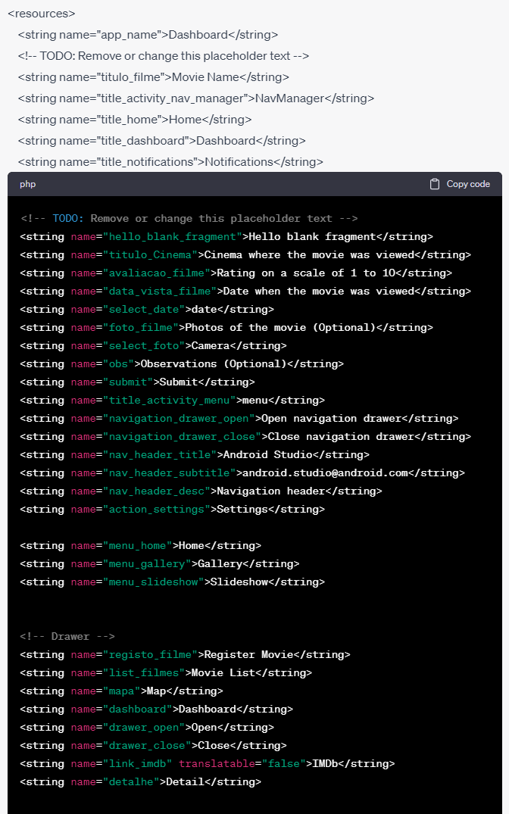
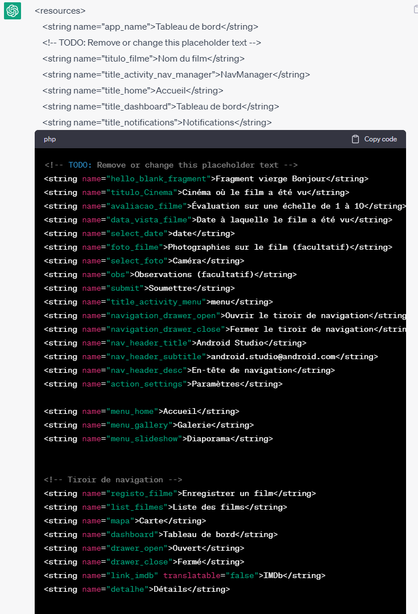
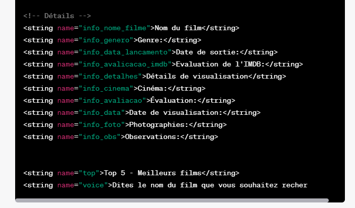

## Dados de aluno

Nome: Bruno Mateus
Número: a22102554
Nome: Diogo Moreira
Número: a22103941

## Filmes hardcoded:
John Wick 4
Avatar 2
Shazam
Homem-Aranha 3

| Critério                                           | Funcionalidades                                                                                                                                                                       |
|----------------------------------------------------|---------------------------------------------------------------------------------------------------------------------------------------------------------------------------------------|
| Dashboard                                          | Existe um ecrã dashboard que permite viualizar o numero de filmes já vistos e um top 5 dos filmes melhor classificados                                                                |
| Apresentação dos filmes -Lista                     | Existe um ecrã onde é representado a lista dos Filmes visualizados                                                                                                                    |
| Apresentação dos filmes - Lista - Rotação          | É possivel rodar o ecrá desse mesmo ecrã de lista, onde acrescenta as observações de cada filme                                                                                       |
| Apresentação dos filmes - Mapa (imagem)            | Existe um ecrã dedicado ao Mapa, onde aparece uma imagem de um mapa dos cinemas de Lisboas                                                                                            |
| Detalhe do filme (sem fotografias)                 | É possivel verificar o detalhe de cada filme na lista, ao selecionar o mesmo irá apresentar um ecrã "Detalhe" onde representa toda a informação solicitada em enunciado de cada filme |
| Detalhe do filme (apenas a parte das fotografias)  | No Ecrã é tambem possivel visualizar as fotografias inseridas no registo                                                                                                              |
| Pesquisa de filmes por voz                         | Existe um botão com um icon de um microfone na barra superior onde ao selecionar abre uma pop-up com uma contagem de 10segundos conforme solicitado em enunciado                      |
| Registo de filmes (sem fotografias)                | Existe um ecrã para efectuar o registo de cada filme com todos os dados pedidos em enunciado                                                                                          |
| Registo de filmes (apenas a parte das fotografias) | Nesse mesmo ecrã é possivel registar tambem as fotografias tiradas através da camera                                                                                                  |
| Suporte multi-idioma                               | Existe tambem suporte de multi-idioma, para as linguagens: Portugues, Frances e Ingles                                                                                                |
| Navegabilidade                                     | A navegação entre ecrãs é feita através de drawer                                                                                                                                     |

### Autoavaliação = 17

## Classes de Lógica de Negócio 

#### Classe Filme:
- Atributos:
-- nome - String
-- cinema - String
-- avaliacao - Int
-- dataVisualizacao - Calendar
-- fotos - List<File>
-- observacoes - String
-- listImgGet - List<File>
- Métodos:
-- listImgGet() : List<File>

#### Classe Filmes:
- Atributos:
-- listImg - mutableListOf<File>
-- listImgGet - List
-- history - mutableListOf<Filme>
- Métodos:
-- listImgGet() : List<File>
-- imagemSet(imgFile : File)
-- imagensListClear()
-- history() : List<Filme>
-- historySet (nome:String, cinema:String, avaliacao:Int, data: Calendar, imgList: List<File>, obs:String):Int
-- top5Filmes() : List<Filme>
-- countFilmes() : Int

#### Classe Cinema:
- Atributos:
-- cinemaName - String

#### Classe Cinemas:
- Atributos:
-- cinema1 - Cinema
-- cinema2 - Cinema
-- cinema3 - Cinema
-- cinema4 - Cinema
-- cinema5 - Cinema
-- cinema6 - Cinema
-- cinema7 - Cinema
-- cinema8 - Cinema
-- cinema9 - Cinema
-- cinema10 - Cinema
-- cinema11 - Cinema
-- listCinemas - mutableListOf<Cinema>
-- getListCinemas - List<Cinema>
- Métodos:
-- getListCinemas : List<Cinema>
-- nomesCinemasGet : List<String>

#### Classe FilmeIMDB:
- Atributos:
-- nomeImdb - String
-- generoImdb - String
-- dataImdb - String
-- avaliacaoImdb - String
-- imgImdb - String
-- sinopse - String

#### Classe FilmesIMDB:
- Atributos:
-- filme1 - FilmeIMDB
-- filme2 - FilmeIMDB
-- filme3 - FilmeIMDB
-- filme4 - FilmeIMDB
-- listFilmesImdb - mutableListOf<FilmeIMDB>
-- getListFilmesImdb - List<FilmeIMDB>
- Métodos:
-- getListFilmesImdb : List<FilmeIMDB>
-- nomesFilmesGet : List<String>

## Idioma gerado pelo Chat GPT assim como os screenshots das prompts:

- Inglês:

- Francês:

## Fontes de informação:
- Chat GPT
- stackoverflow
- youtube

