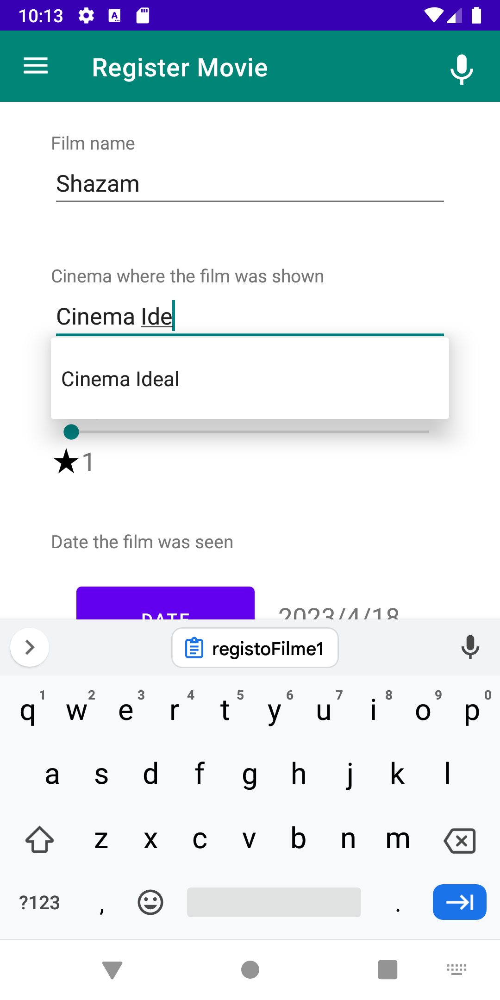
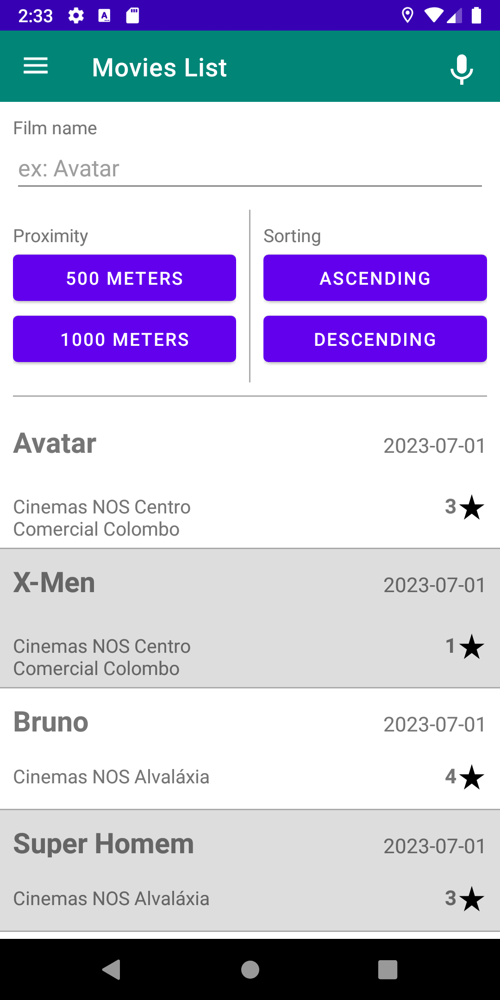
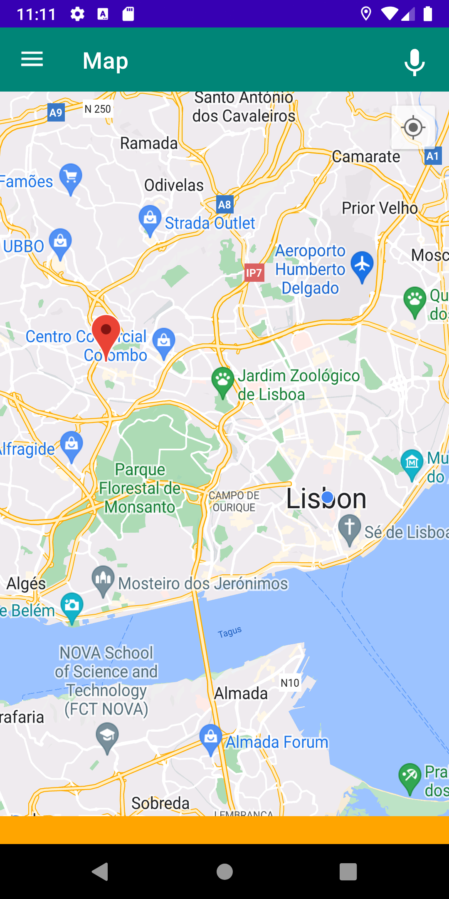

## Dados de aluno

Nome: Bruno Mateus  
Número: a22102554  

## Link video:
  

## Ecrãs:

### Dashboard
-------------

### Registo

### Lista Filmes

### Detalhe do Filme

### Mapa

### Pesquisa de voz

## Critérios

### Parte I

| Critério                                           | Funcionalidades                                                                                                                                                                                                                                                           |
|----------------------------------------------------|---------------------------------------------------------------------------------------------------------------------------------------------------------------------------------------------------------------------------------------------------------------------------|
| Dashboard                                          | Existe um ecrã dashboard que permite viualizar o numero de filmes já vistos e um top 5 dos filmes melhor classificados                                                                                                                                                    |
| Apresentação dos filmes -Lista                     | Existe um ecrã onde é representado a lista dos Filmes visualizados                                                                                                                                                                                                        |
| Apresentação dos filmes - Lista - Rotação          | É possivel rodar o ecrá desse mesmo ecrã de lista, onde acrescenta as observações de cada filme                                                                                                                                                                           |
| Apresentação dos filmes - Mapa (imagem)            | Existe um ecrã dedicado ao Mapa, onde aparece uma imagem de um mapa dos cinemas de Lisboas                                                                                                                                                                                |
| Detalhe do filme (sem fotografias)                 | É possivel verificar o detalhe de cada filme na lista, ao selecionar o mesmo irá apresentar um ecrã "Detalhe" onde representa toda a informação solicitada em enunciado de cada filme                                                                                     |
| Detalhe do filme (apenas a parte das fotografias)  | No Ecrã é tambem possivel visualizar as fotografias inseridas no registo                                                                                                                                                                                                  |
| Pesquisa de filmes por voz                         | Existe um botão com um icon de um microfone na barra superior onde ao selecionar abre uma pop-up com uma contagem de 10segundos conforme solicitado em enunciado                                                                                                          |
| Registo de filmes (sem fotografias)                | Existe um ecrã para efectuar o registo de cada filme com todos os dados pedidos em enunciado                                                                                                                                                                              |
| Registo de filmes (apenas a parte das fotografias) | Nesse mesmo ecrã é possivel registar tambem as fotografias tiradas através da camera                                                                                                                                                                                      |
| Suporte multi-idioma                               | Existe tambem suporte de multi-idioma, para as linguagens: Portugues, Frances e Ingles                                                                                                                                                                                    |
| Navegabilidade                                     | A navegação entre ecrãs é feita através de drawer                                                                                                                                                                                                                         |

### Parte II + Recurso

| Critério                                             | Funcionalidades                                                                                                                                                                                                                                                           |
|------------------------------------------------------|---------------------------------------------------------------------------------------------------------------------------------------------------------------------------------------------------------------------------------------------------------------------------|
| Regista Já                                           | É possivel ir para o ecrã de registo de uma avaliação apenas agitando o smartphone |
| Registo de filmes                                    | É possivel registar uma avaliação de um filme caso exista acesso à internet |
| Inserir corretamente na base de dados                | Os registos na base de dados são inseridos corretamente |
| Validação e obtenção dos dados do filme via API      | Os dados dos filmes são obtidos via API e guardados na base de dados local |
| Validação e obtenção dos dados do cinema via JSON    | Os dados dos cinemas são obtidos via JSON e guardados na base de dados local |
| Utilização de geo-localização                        | No fragmento Mapa é utilizada a geolocalização |
| Inserir fotografias na base de dados                 | As fotografias referentes à avaliação são guardadas na base de dados com id da avaliação |
| Apresentação dos filmes -Lista                       | Os filmes são apresentados em forma de lista |
| Apresentação dos filmes - Mapa                       | Os filmes são apresentados no mapa através de markers |
| Filtros - Apresentação em Lista                      | É possivel filtrar os filmes por pesquisa do nome do filme ou até mesmo pela proximidade de 500 ou 1000 metros, ainda é possivel filtrar os filtros em conjunto com a ordenação |
| Ordenação - Apresentação em Lista                    | É possivel ordenar os filmes pela ordem crescente ou decrescente e tambem é possivel combinar com os filtros |
| Detalhe do filme (sem fotografias)                   | O filme é apresentado sem fotografias |
| Detalhe do filme (apenas a parte das fotografias)    | O filme apresenta fotografias inseridas num recycler view |
| Pesquisa de filmes por voz - Funcionalidade Avançada | É possível procurar um filme que tenha sido avaliado por voz |
| Dashboard                                            | O ecrã dashboard que permite viualizar o numero de filmes já vistos e um top 5 dos filmes melhor classificados |
| Funcionamento Offline - Funcionalidade Avançada      | A aplicação funciona de modo offline apenas para visualização de avaliações já inseridas |
| Video                                                |  |

### Autoavaliação = 17

## Classes de Lógica de Negócio 

#### Classe Avaliacao:
- Atributos:  
-- id - String  
-- filme - Filme  
-- cinema - Cinema  
-- avaliacao - Int  
-- dataVisualizacao - Long  
-- fotos - List<File>?  
-- observacoes - String  

#### Classe Filme:
- Atributos:  
-- id - String  
-- nome - String  
-- generoImbd - String  
-- dataImbd - Long  
-- avaliacaoImbd - String  
-- imgImbd - String  
-- sinopse - String?  

#### Classe Cinema:
- Atributos:  
-- cinema_id - Int  
-- cinema_name - String  
-- latitude - Double  
-- longitud - Double  
-- morada - String  
-- localidade - String  
  
  #### Classe abstrata Operações:
- Métodos:  
- Filmes:  
-- getAllFilmes(onFinished: (Result<List<Avaliacao>>) -> Unit)  
-- inserirFilme(filme: Filme, avaliacao: Avaliacao, onFinished: () -> Unit)  
-- getFilmeIMDB(nome: String, onFinished: (Result<Filme>) -> Unit)  
-- getFilme(id: String, onFinished: (Result<Filme>) -> Unit)  
-- verificarFilme(nome: String, onFinished: (Int) -> Unit)  
- Avaliações:  
-- getAllAvaliacoes(onFinished: (Result<List<Avaliacao>>) -> Unit)  
-- getAvaliacao(id : String, onFinished: (Result<Avaliacao>) -> Unit)  
-- inserirAvaliacao(filme: Filme, avaliacao: Avaliacao, onFinished: (Result<Filme>) -> Unit)  
-- getAvaliacaoIdFromFilmeName(nome: String, onFinished: (Result<String>) -> Unit)  
-- inserirFotosAvaliacao(fotos: List<File>, idAvaliacao: String, onFinished: () -> Unit)  
-- getAllFotosFromAvaliacao(id: String, onFinished: (Result<List<File>>) -> Unit)  
-- getAvaliacaoCheckCinema(idCinema: Int, onFinished: (Result<Int>) -> Unit)  
-- countAvaliacoes(onFinished: (Result<Int>) -> Unit)  
-- top5Avaliacoes(onFinished: (Result<List<Avaliacao>>) -> Unit)  
- Cinemas:  
-- getCinemasJSON(onFinished: (Result<List<Cinema>>) -> Unit)  
-- inserirCinemas(cinemas : List<Cinema>, onFinished: () -> Unit)  
-- getCinemaByNome(cinema : String, onFinished: (Result<Cinema>) -> Unit)  
-- getCinemaById(idCinema : Int, onFinished: (Result<Cinema>) -> Unit)  
-- verificarCinema(nome : String, onFinished: (Int) -> Unit)  
-- getAllCinemasNomes(onFinished: (Result<List<String>>) -> Unit)  
-- clearAllCinemas(onFinished: () -> Unit)  
  

## Idioma gerado pelo Chat GPT assim como os screenshots das prompts:

## Fontes de informação:
- Chat GPT
- stackoverflow
- youtube

